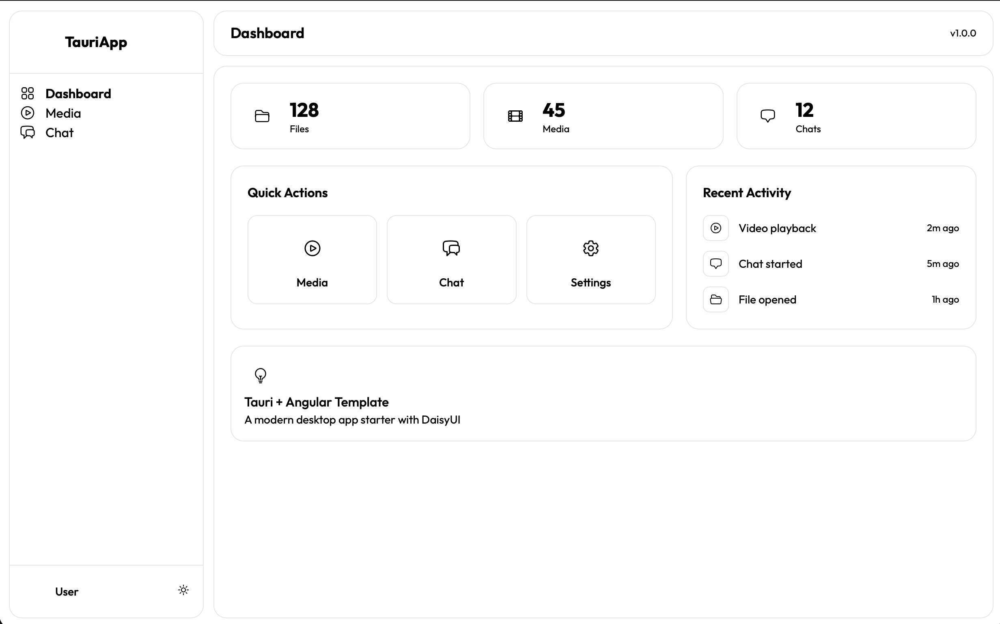

# Tauri + Angular Media & Chat App



A modern interaction-focused desktop application built with **Tauri v2** (Rust) and **Angular 17** (TypeScript).

## 🚀 Features

- **Media Player**: Video and audio playback UI (**Frontend Layout Only**). Currently uses browser-native file selection; does not yet utilize the Tauri backend for file operations.
- **AI Chat**: Interactive chat interface (**UI Mockup**). Demonstrates the chat layout and styling; currently uses hardcoded responses and is not connected to an AI backend.
- **Modern UI**: Built with Tailwind CSS and DaisyUI, featuring a responsive layout and polished dark/light mode.
- **Native Integration Foundation**:
  - Rust backend is set up with basic commands (`greet`, `open_file_dialog`).
  - Ready for future implementation of native file system and AI features.

## 🛠️ Tech Stack

- **Frontend**:
  - Angular 17+
  - Tailwind CSS + DaisyUI
  - TypeScript
- **Backend**:
  - Rust (Tauri v2)
  - `tauri-plugin-dialog`, `tauri-plugin-shell`, `tauri-plugin-opener`

## 📦 Prerequisites

Before starting, ensure you have the following installed:

- **Node.js** (v18+) & **Yarn**
- **Rust** & **Cargo** (latest stable)
- **Tauri CLI** (optional, included in devDependencies)

## 💻 Getting Started

1.  **Install Dependencies**
    ```bash
    yarn install
    ```

2.  **Run Development Server**
    This command starts both the Angular frontend and the Tauri backend window in development mode.
    ```bash
    yarn tauri dev
    ```

## 📂 Project Structure

- **`src/`**: Angular frontend source code.
  - **`app/media-viewer/`**: Media player component logic.
  - **`app/chat/`**: AI chat interface logic.
  - **`app/services/`**: Integration services (e.g., `TauriService`).
  - **`assets/`**: Static assets.
- **`src-tauri/`**: Rust backend code.
  - **`src/main.rs`**: Entry point and command registration.
  - **`src/commands.rs`**: Custom Tauri commands (`greet`, `open_file_dialog`).
  - **`src/dialog_handler.rs`**: Implementation of file dialog handling.

## 🔧 Building

To build the application for production (creates a native executable installer):

```bash
yarn tauri build
```

## 📝 Developer Notes

- **Backend Commands**: The current backend implements `greet` and `open_file_dialog`.
- **Frontend Services**: `TauriService` contains type definitions for a broader set of APIs (e.g., AI sessions, system info) that are designed for future backend implementation.
